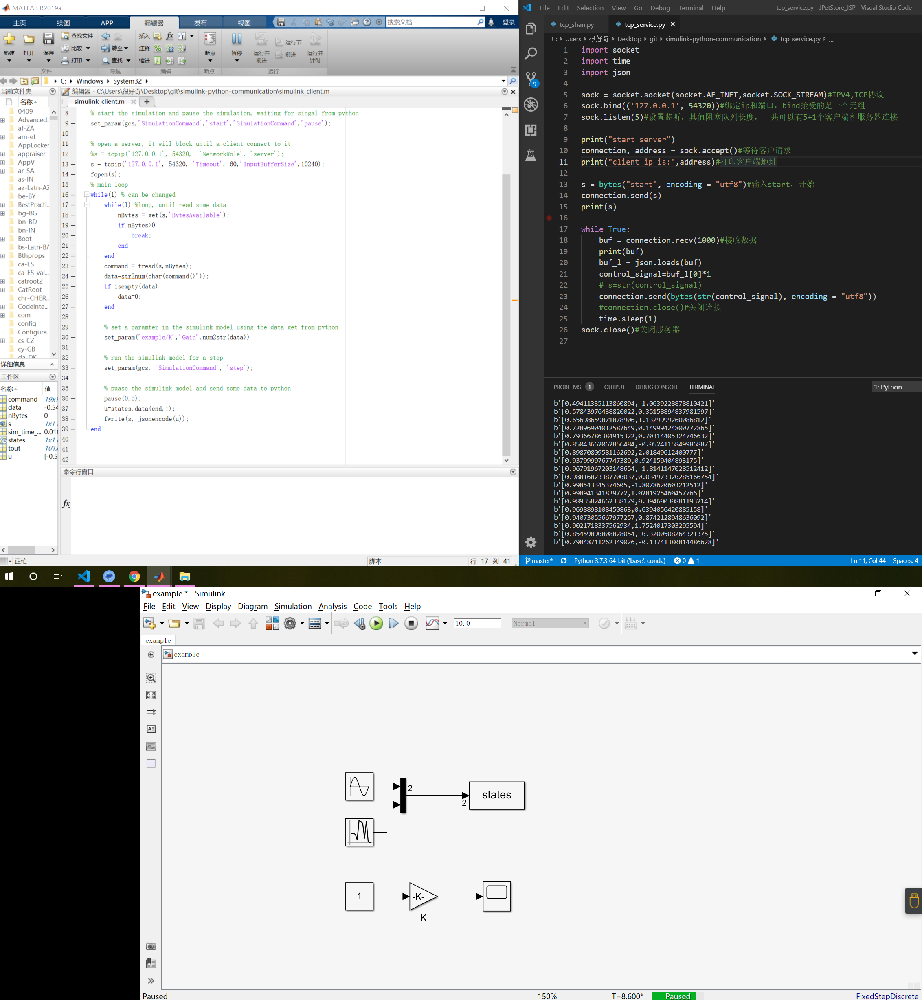
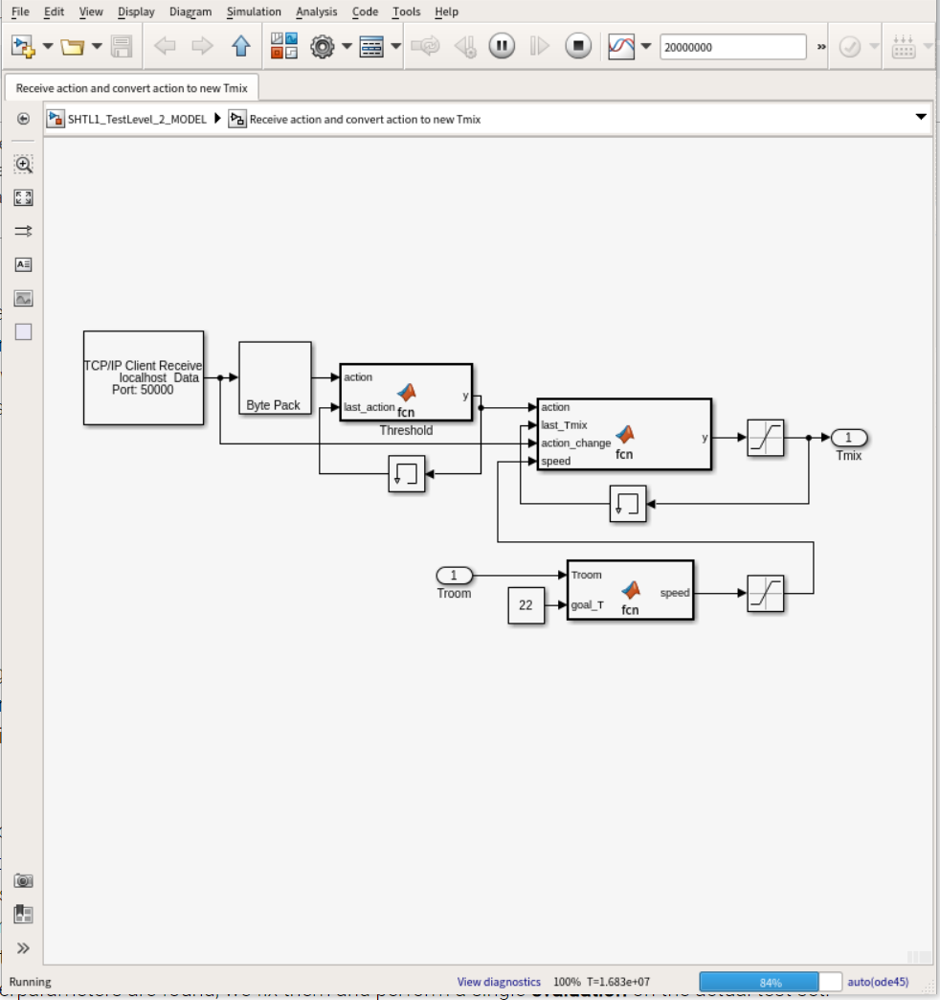
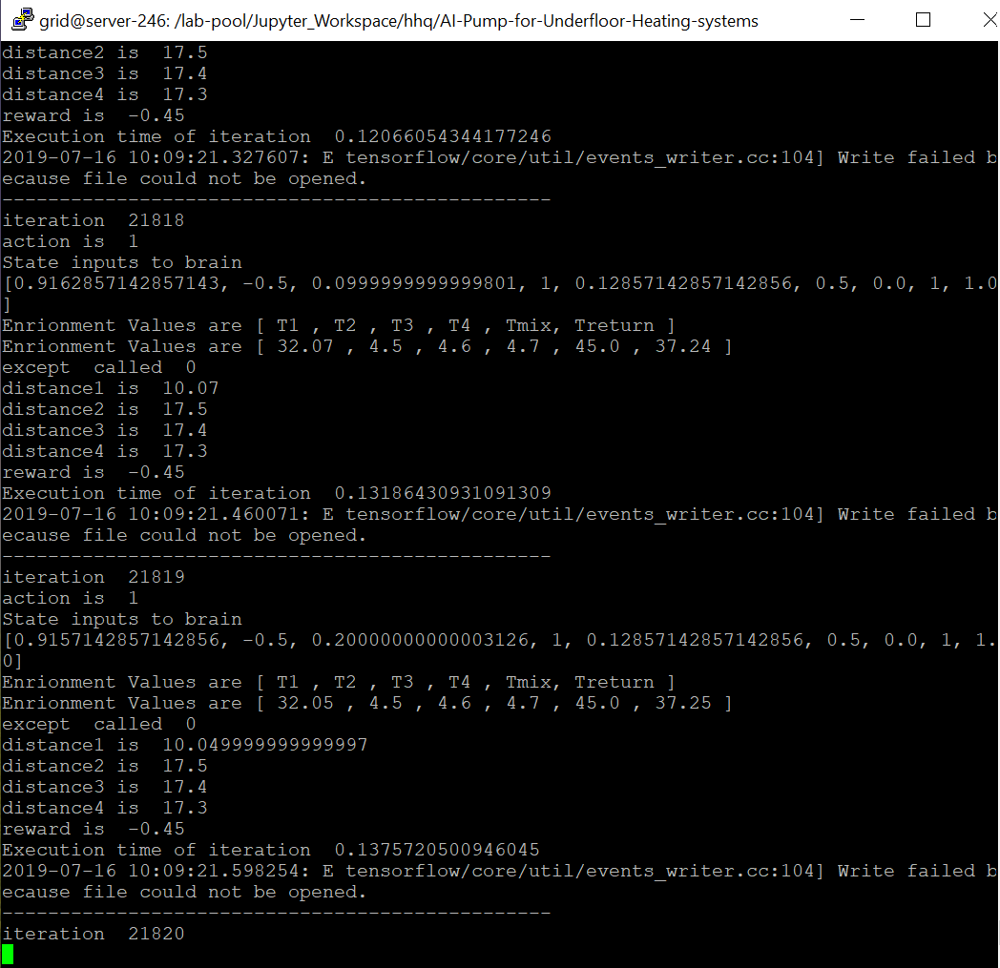

# simulink_python

使用simulink进行环境的模拟，使用python编写强化学习代码

## 快速开始

## 项目简介

* ##### tcp通信模块测试

  matlab与python之间使用tcp协议进行本地阻塞式通信，matlab接收python端信息后，才能使用simulink进行模拟（目前未解决模拟步长问题）。

  尝试将matlab和python分别作为客户端和服务端进行测试。其中，matlab作为客户端模拟100步时间为20s，python作为客户端模拟100步时间为2min。测试代码在[这里](./tcp_connection_attempt)。

  

* ##### rl模块测试

  ~~使用的是经典的[CartPole](./some_simulink_model/rlCartPoleSimscapeModel.slx)模型~~

  在调bug无果之后，准备先试试这个[项目](https://github.com/qLience/AI-Pump-for-Underfloor-Heating-systems) 

* ##### 尝试项目

  项目缺少'svdutilitieslib' matlab，提示install 'Embedded Coder Support Package for ARM Cortex-A Processors，安装完之后发现无法打开matlab

  将中文用户名修改为英文之后，问题解决，打开matlab之后发现所安装的模块没起作用，继续安装其他可能有用的模块

* ##### 在服务器是部署安装matlab

  找到了两篇很好的博客，一个是[如何安装](<https://blog.csdn.net/u011387593/article/details/84883474>)，一个是[更好的使用matlab](<https://www.cnblogs.com/yinxiangnan-charles/p/5625463.html>)，如果本地用不了的话就准备用服务器上的matlab了

* ##### 调试并开始训练

  分别跑了pytorch版本和tensorflow版本的dqn

  1. 发现其pytorch版本非常陈旧，准备自己重写
  2. tensorflow版本的没有问题，出现权限获取失败的错误，准备chmod那个目录，但现在显卡似乎not free，准备待会再跑
  3. 两者的报错日志记录[在这](log.txt)B.T.W，服务器打开matlab 耗时10s，除了操作不方便意外没什么缺点

* ##### 训练成功

  tensorflow 修改目录权限后跑通了，但还是报了Write failed because file could not be opened的下一步准备进行一些修改吧(包括环境和网络)

  截图如下:

  

  

* [有关rl_attention的一些论文](./attention_rl.md)，有时间再去看吧

* ##### 开始重写其代码并进行训练

  1. 代码放置在[test文件夹](./test)中,初步将其action_space和state_space分别定为3,3。通信的频率和间歇性通信还有待处理。在这之后准备用matlab写的CartPole进行测试

* ##### tips：

  Google之后没有发现使用Pymodelica搭建模型的RL项目，不准备使用modelica入手

  [关于attention的调查](./attention_rl)

### 参考链接

* [UDP&TCP通信测试](<https://blog.csdn.net/tiancai13579/article/details/53039437?locationNum=5&fps=1>)
* [调用simulink&通信](<https://github.com/sherrysherryli/simulink-python-communication>)
* [Create Simulink Environments for Reinforcement Learning](<https://www.mathworks.com/help/reinforcement-learning/ug/create-simulink-environments-for-reinforcement-learning.html>)
* [Load Predefined Simulink Environments](<https://www.mathworks.com/help/reinforcement-learning/ug/create-predefined-simulink-environments.html>)
* [Train DDPG Agent to Swing Up and Balance Cart-Pole System](<https://www.mathworks.com/help/reinforcement-learning/ug/train-ddpg-agent-to-swing-up-and-balance-cart-pole-system.html>)

*  [qLience / AI-Pump-for-Underfloor-Heating-systems](https://github.com/qLience/AI-Pump-for-Underfloor-Heating-systems)
